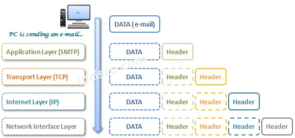

# System Programming

* [TRANSMISSION CONTROL PROTOCOL](https://datatracker.ietf.org/doc/html/rfc793)
* [User Datagram Protocol](https://datatracker.ietf.org/doc/html/rfc768)
* [INTERNET PROTOCOL](https://datatracker.ietf.org/doc/html/rfc791)

## What is a socket?

A way to speak to other programs using standard Unix file descriptors.

Unix programs do any sort of I/O, they do it by reading or
writing to a file descriptor. A file descriptor is simply an integer associated with an open file. But (and here’s
the catch), that file can be a network connection, a FIFO, a pipe, a terminal, a real on-the-disk file, or just
about anything else. Everything in Unix is a file! So when you want to communicate with another program
over the Internet you’re gonna do it through a file descriptor.

##

### Stream Sockets : “SOCK_STREAM”

Stream sockets are reliable two-way connected communication streams. If you output two items into the socket in the order “1, 2”, they will arrive in the order “1, 2” at the opposite end. They will also be error-free.

telnet or ssh 

How do stream sockets achieve this high level of data transmission quality? They use a protocol called “The
Transmission Control Protocol”, otherwise known as “TCP” (see RFC 7933
for extremely detailed info on
TCP). TCP makes sure your data arrives sequentially and error-free. You may have heard “TCP” before as
the better half of “TCP/IP” where “IP” stands for “Internet Protocol” (see RFC 7914
). IP deals primarily
with Internet routing and is not generally responsible for data integrity.

### Datagram Sockets (connectionless sockets) : “SOCK_DGRAM”

What about Datagram sockets? Why are they called connectionless? What is the deal, here, anyway?
Why are they unreliable? Well, here are some facts: if you send a datagram, it may arrive. It may arrive out
of order. If it arrives, the data within the packet will be error-free.
Datagram sockets also use IP for routing, but they don’t use TCP; they use the “User Datagram Protocol”,
or “UDP” (see RFC 7685
).

Why are they connectionless? Well, basically, it’s because you don’t have to maintain an open connection
as you do with stream sockets. You just build a packet, slap an IP header on it with destination information,
and send it out. No connection needed. They are generally used either when a TCP stack is unavailable or
when a few dropped packets here and there don’t mean the end of the Universe. Sample applications: tftp
(trivial file transfer protocol, a little brother to FTP), dhcpcd (a DHCP client), multiplayer games, streaming
audio, video conferencing, etc.

“Wait a minute! tftp and dhcpcd are used to transfer binary applications from one host to another! Data
can’t be lost if you expect the application to work when it arrives! What kind of dark magic is this?”
Well, my human friend, tftp and similar programs have their own protocol on top of UDP. For example,
the tftp protocol says that for each packet that gets sent, the recipient has to send back a packet that says,
“I got it!” (an “ACK” packet). If the sender of the original packet gets no reply in, say, five seconds, he’ll
re-transmit the packet until he finally gets an ACK. This acknowledgment procedure is very important when
implementing reliable SOCK_DGRAM applications.
For unreliable applications like games, audio, or video, you just ignore the dropped packets, or perhaps try to
cleverly compensate for them. (Quake players will know the manifestation this effect by the technical term:
accursed lag. The word “accursed”, in this case, represents any extremely profane utterance.)
Why would you use an unreliable underlying protocol? Two reasons: speed and speed. It’s way faster to
fire-and-forget than it is to keep track of what has arrived safely and make sure it’s in order and all that. If
you’re sending chat messages, TCP is great; if you’re sending 40 positional updates per second of the players
in the world, maybe it doesn’t matter so much if one or two get dropped, and UDP is a good choice.

##

### IPv4 : 2^32

### IPv6 : 2^128

### Subnet

192.0.2.12/24 -> 192.0.2.12 -> 192.0.2 : Network, 12 : Host, Netmask : 255.255.255.0, Ip & Netmask = Network
Class A -> 2^24 Host
Class B -> 2^16 Host
Class C -> 2^8 Host

Private Address Spaces and Localhost : 10.0.0.0/8, 172.16.0.0/12, 192.168.0.0/16, 127.0.0.0/8

### Ports

Besides an IP address (used by the IP layer), there is another address that is used by TCP (stream sockets) and, coincidentally, by UDP (datagram sockets). It is the port number. It’s a 16-bit number that’s like the local address for the connection.

Say you want to have a computer that handles incoming mail AND web services—how do you differentiate between the two on a computer with a single IP address?

### Byte order

### NAT

## System Calls

When you call one of these functions, the kernel takes over and does all the work for you automagically.

* getaddrinfo, socket, bind, listen, connect, accept, send, recv, sendto, recvfrom, close, shutdown, getpeername, gethostname

## Client-Server

Note that the client-server pair can speak SOCK_STREAM, SOCK_DGRAM, or anything else (as long as they’re speaking the same thing). Some good examples of client-server pairs are telnet/telnetd, ftp/ftpd, or Firefox/Apache. Every time you use ftp, there’s a remote program, ftpd, that serves you.

Often, there will only be one server on a machine, and that server will handle multiple clients using fork(). The basic routine is: server will wait for a connection, accept() it, and fork() a child process to handle it.

## TCP

TCP is reliable because it overcomes the effects of packet loss or receiving packets out of order. 
Packet loss occurs when data fails to reach its destination—typically because of data transmission errors (such as wireless network interference) or network congestion. 
Network congestion happens when nodes attempt to send more data over a network connection than the connection can handle, causing the nodes to discard the excess packets. 
TCP adapts its data transfer rate to make sure it transmits data as fast as possible while keeping dropped packets to a minimum. 
TCP also keeps track of received packets and retransmits unacknowledged packets, as necessary. 
There is no guarantee that all packets you send take the same route for the duration of the TCP session. 
Thankfully, TCP organizes unordered packets and processes them in sequence.

### TCP Sessions

A TCP session allows you to deliver a stream of data of any size to a recipient and receive confirmation that the recipient received the data. This
saves you from the inefficiency of sending a large amount of data across a network, only to find out at the end of the transmission that the recipient
didn’t receive it. 

A TCP connection uses a three-way handshake to introduce the client to the server and the server to the client. The handshake creates an established
TCP session over which the client and server exchange data.

Dial                          Listen
| ------Syn(x)--------------> |
| <-----Ack(x+1),Syn(y)------ |
| ------Ack(y+1)------------> |

window size: which is the number of bytes the sender can transmit to the receiver without requiring an acknowledgment
sliding window : receiving the window size in an ACK packet, sending data, receiving an updated window size in the next ACK, and then sending more data

Terminating TCP Sessions
Dial                  Listen
| ------Fin---------> |
| <-----Ack, Fin----- |
| ------Ack---------> |
