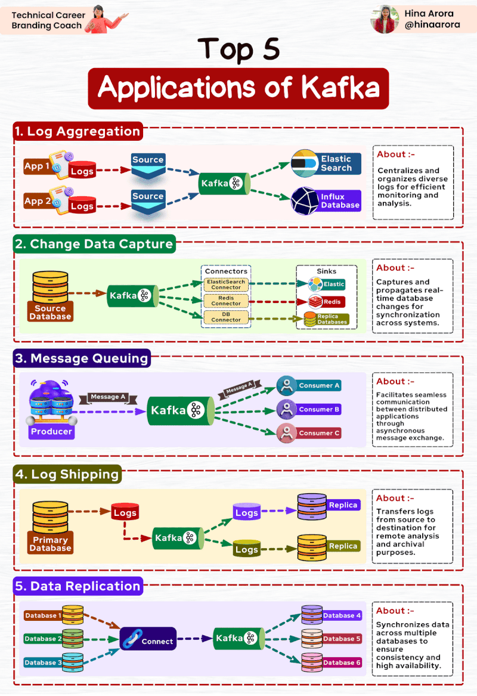
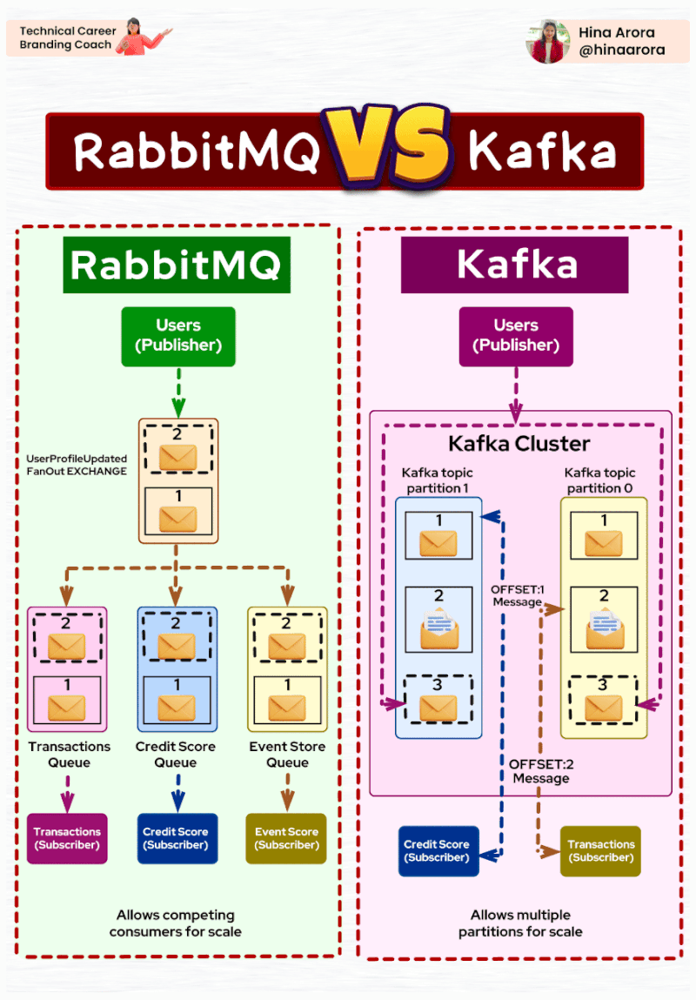

# Kafka

* [Course | Apache Kafka Fundamentals](https://www.youtube.com/playlist?list=PLa7VYi0yPIH2PelhRHoFR5iQgflg-y6JA)
* [Apache Kafka Tutorials | Kafka 101](https://www.youtube.com/playlist?list=PLa7VYi0yPIH0KbnJQcMv5N9iW8HkZHztH)
* [Kafka Connect Tutorials | Kafka Connect 101](https://www.youtube.com/playlist?list=PLa7VYi0yPIH0uIC2F0M1_FsVUsx8j3ekm)
* [Kafka Streams Tutorials | Kafka Streams 101](https://www.youtube.com/playlist?list=PLa7VYi0yPIH35IrbJ7Y0U2YLrR9u4QO-s)
* [ksqlDB & Advanced Stream Processing Tutorials](https://www.youtube.com/playlist?list=PLa7VYi0yPIH0SG2lvtS2Aoa12F22jKYYJ)
