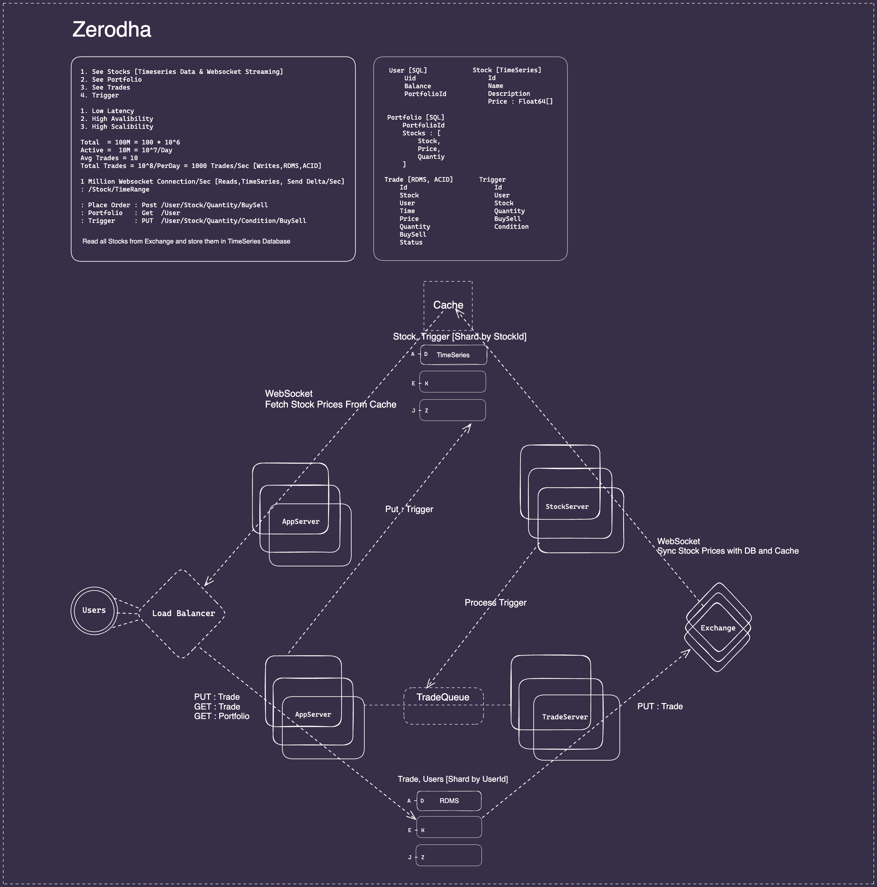
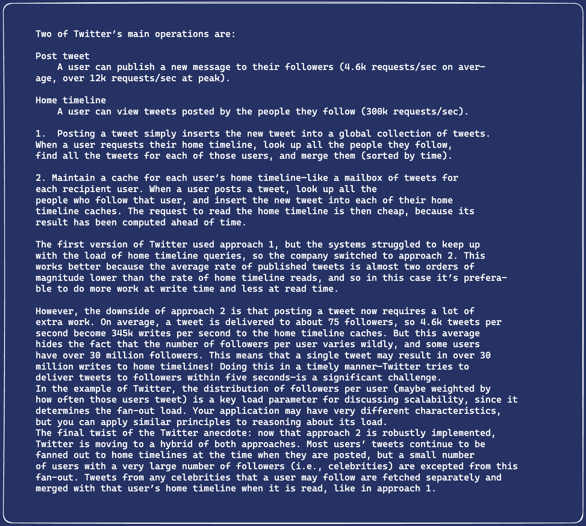

# Go Experiments

## Go Guide

* [Learn Go with Tests](https://quii.gitbook.io/learn-go-with-tests/)
* [Go Style Guide](https://github.com/uber-go/guide/blob/master/style.md)
* [Effective Go](https://go.dev/doc/effective_go)
* [Effective Go](https://github.com/pthethanh/effective-go)
* [Go Patterns](https://github.com/tmrts/go-patterns)
* [100 Go Mistakes and How to Avoid Them](https://100go.co)

* [Workshop: Practical Go](https://www.youtube.com/watch?v=gi7t6Pl9rxE)
* [Go For TypeScript Developers - Use Your TypeScript Skills to Learn Go](https://www.youtube.com/watch?v=ptuQ7xncV7A)
* [Intermediate level Golang](https://www.youtube.com/playlist?list=PLSozy2hb5kKPpIJnpZ2sSMfjVjP0tyJYG)

* Writing An Interpreter In Go
* Writing A Compiler In Go

## Level 1

* [Grpc & Protocol Buffers](GrpcGo/README.md)

## Level 2

* [DevOps Full Course Using Go](https://www.youtube.com/playlist?list=PL7g1jYj15RUMdka_gPLDCFrIhwjtvCLJD)

## Level 3

* [How to deploy your website to production in 30 minutes](https://www.youtube.com/watch?v=gViEtIJ1DCw)

## Distributed System

* [The Raft Consensus Algorithm](https://www.youtube.com/watch?v=rVe_F_4H_60)
* [You Must Build A Raft](https://www.youtube.com/watch?v=Hm_m4MIXn9Q)
* [Distributed Consensus with Raft](https://www.youtube.com/watch?v=RHDP_KCrjUc)
* [Designing for Understandability: The Raft Consensus Algorithm](https://www.youtube.com/watch?v=vYp4LYbnnW8)
* [Distributed Systems lecture series](https://www.youtube.com/playlist?list=PLeKd45zvjcDFUEv_ohr_HdUFe97RItdiB)
* [Raft - The Understandable Distributed Protocol](https://www.youtube.com/watch?v=ro2fU8_mr2w)
* [Understand RAFT without breaking your brain](https://www.youtube.com/watch?v=IujMVjKvWP4)
* [Mastering the Raft Consensus Algorithm: A Comprehensive Tutorial in Distributed Systems](https://www.youtube.com/watch?v=ZyqAbQkpeUo)
* [Raft, Build Your Own Distributed System Using Go](https://www.youtube.com/watch?v=8XbxQ1Epi5w)

* https://raft.github.io/raft.pdf

* https://github.com/ongardie/raft.tla

* https://github.com/eatonphil/goraft
* https://github.com/eliben/raft

* [Implementing the Raft distributed consensus protocol in Go](https://notes.eatonphil.com/2023-05-25-raft.html)
* [Implementation of the Raft Consensus Algorithm](https://dzone.com/articles/implementation-of-the-raft-consensus-algorithm-usi)
* https://eli.thegreenplace.net/2020/implementing-raft-part-0-introduction/

### Microservices

* [Handling timeouts in a microservice architecture](https://www.youtube.com/watch?v=Hxja4crycBg)

## Projects

* [52 Golang Projects](https://github.com/kkdai/project52)

* https://github.com/zjbztianya/go-misc

* https://github.com/Reanon/maglev
* https://github.com/kkdai/maglev

* [Designing an On-Demand Video Streaming Service](https://hackernoon.com/designing-an-on-demand-video-streaming-service)

* [Re-implementation of Redis in Golang](https://github.com/DiceDB/dice)

* [🐙 Yet another load balancer](https://github.com/onestraw/golb)

* https://github.com/anthdm/superkit

### Microservices

* https://github.com/GoogleCloudPlatform/microservices-demo

* https://github.com/meysamhadeli/shop-golang-microservices

* https://github.com/mehdihadeli/go-food-delivery-microservices

* https://github.com/AleksK1NG/Go-GRPC-Auth-Microservice
* https://github.com/AleksK1NG/Go-gRPC-RabbitMQ-microservice

* https://github.com/shijuvar/go-distributed-sys

## Cloud

### Google Cloud

* [`GKE Samples`](https://github.com/GoogleCloudPlatform/kubernetes-engine-samples)

* [Google Cloud Networking Series](https://www.youtube.com/playlist?list=PLkJoVgst5ibYnPy0I5w5RTa4BZDX2cPQe)
* [Google Cloud Build Tutorials and How to](https://www.youtube.com/playlist?list=PLn275E3eumb7yh4K8Z_fnpxkNffyTC0u4)

* [GCP Topics](https://www.youtube.com/playlist?list=PLn275E3eumb6KRtTDLOfEV2VWF8N9Mn-X)
* [GCP (Google Cloud Platform) Security](https://www.youtube.com/playlist?list=PLn275E3eumb5TEwg6IQbv7EVo53t4mDEl)

* [Networking End to End](https://www.youtube.com/playlist?list=PLIivdWyY5sqJ0oXcnZYqOnuNRsLF9H48u)

* [Google Cloud Platform Learning Series](https://www.youtube.com/playlist?list=PLkJoVgst5ibapmObyPLz2uKytahU-HE2c)

#### Networking

* [Maglev: A Fast and Reliable Software Network Load Balancer](https://static.googleusercontent.com/media/research.google.com/en//pubs/archive/44824.pdf)
* [High Availability Load Balancers with Maglev](https://blog.cloudflare.com/high-availability-load-balancers-with-maglev)

* [Cloud Load Balancing Deep Dive and Best Practices](https://www.youtube.com/watch?v=HUHBq_VGgFg)

#### Data

* [Google Cloud Data Engineer Certification Course](https://www.youtube.com/playlist?list=PLLrA_pU9-Gz1TbaEIlUVfAqZ853LmDPib)

## Devops

### Terraform

* [`Terraform on GCP`](https://github.com/GoogleCloudPlatform/cloud-foundation-fabric)
* [`terraform-google-kubernetes-engine`](https://github.com/terraform-google-modules/terraform-google-kubernetes-engine/tree/master/examples)

* [Let's Learn Terraform in GCP | Basics of Terraform](https://www.youtube.com/playlist?list=PLn275E3eumb75IhjQOqmtx8MUaK5hVV38)

* [GCP Infrastructure as Code with Terraform](https://www.youtube.com/watch?v=Z8OIR7Jdxy4)

* [Google Cloud with Terraform](https://www.youtube.com/playlist?list=PLkJoVgst5ibbxW_tGq7_9l3NAQvB5-LJO)

## System design

1 Mega  = 1 Mil  = 10^6
1 Terra = 1 Bil  = 10^9
1 H = 3600
1 D = 10^5

* https://eda-visuals.boyney.io/

* [System Design Pratiksha](https://www.youtube.com/playlist?list=PLWp3jRAb6-XWmlu9R96p3xp0G_F3kdq3x)

* [I coded Zerodha's Trading Algorithm in 1 hour](https://www.youtube.com/watch?v=aEMBp9Bqfwc)

* [Exponent System Design](https://www.youtube.com/playlist?list=PLrtCHHeadkHp92TyPt1Fj452_VGLipJnL)

* [Algorithms in Distributed Systems, Two Phase Commit](https://www.youtube.com/playlist?list=PLsdq-3Z1EPT1wfRQo2xrrst2SGremT_qd)

* ByteByteGo
* [System Design Interview: Design A Location Based Service (Yelp, Google Places)](https://www.youtube.com/watch?v=M4lR_Va97cQ)

* Pratiksha
* [System Design Interviews](https://www.youtube.com/playlist?list=PLWp3jRAb6-XWmlu9R96p3xp0G_F3kdq3x)

* [System Design Concepts for Beginners](https://www.youtube.com/playlist?list=PLT3bGNUOvbdKThX9LDJQll4TdkVvw8IT6)

* Exponent
* [Design Tinder - System Design Interview](https://www.youtube.com/watch?v=iyLqwyFL0Zc)

* [System Design Walkthroughs](https://www.youtube.com/playlist?list=PL5q3E8eRUieWtYLmRU3z94-vGRcwKr9tM)

* Kiki
* [How Pinterest Scaled to 11 Million Users With Only 6 Engineers](https://www.youtube.com/watch?v=QRlP6BI1PFA)
* [How Instagram Scaled to 14 Million Users With Only 3 Engineers](https://www.youtube.com/watch?v=TdhXPsDXdAI)

* [System design mock interviews](https://www.youtube.com/playlist?list=PLf3F6FcQwgqEpnucyupbIqzxyvFOz9uDq)

* InterviewPen
* [System Design](https://www.youtube.com/playlist?list=PLPkuArhPxxQGkbl-_STo8FFxBBB4ri-tl)

* NeetCode
* [Design Youtube - System Design Interview](https://www.youtube.com/watch?v=jPKTo1iGQiE)

* [Scaling Hotstar for 25 million concurrent viewers](https://www.youtube.com/watch?v=QjvyiyH4rr0)

* [How to Build an Exchange](https://www.youtube.com/watch?v=b1e4t2k2KJY)

* 
* [Stock Exchange System Design : Distributed Transactions, Financial System](https://www.youtube.com/watch?v=XuKs2kWH0mQ)

* [Back-Of-The-Envelope Estimation / Capacity Planning](https://www.youtube.com/watch?v=UC5xf8FbdJc)

* [Bloom Filters](https://www.youtube.com/watch?v=V3pzxngeLqw)
* [Consistent Hashing | Algorithms You Should Know #1](https://www.youtube.com/watch?v=UF9Iqmg94tk)

